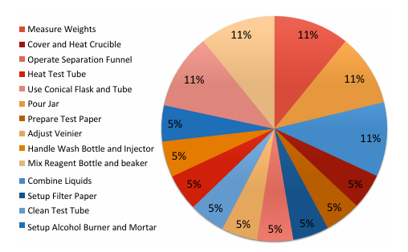
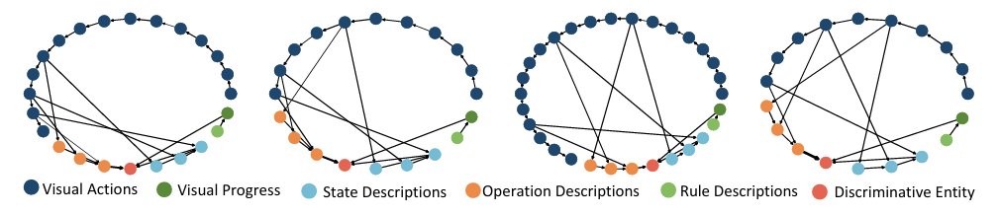

# PHGC: Procedural Heterogeneous Graph Completion for Natural Language Task Verification in Egocentric Videos

---

## 📚 Table of Contents
- [Introduction](#introduction)
- [Installation](#installation)
- [Visualizations](#visualizations)

---

## 📝 Introduction

Natural Language-based Egocentric Task Verification(NLETV) aims to equip agents with the ability to determine if operation flows of procedural tasks in egocentric videos align with natural language instructions. In this paper, we proposed a novel approach termed **Procedural Heterogeneous Graph Completion(PHGC)**, which addresses these challenges with heterogeneous graphs representing the logic in rules and operation flows.

*We have released our extended benchmark dataset [EgoCross](https://xunchn.github.io/EgoCross/).*


<div align="center">
   
   <br><br>
   
   <br><br>
   
</div>


## ⚙️ Installation

Follow these steps to set up the project:

1. **Set up your environment.**

```shell
conda env create -f environment.yaml
```
2. **Download the checkpoints.**

   We have uploaded the checkpoints of model training on EgoTV and CSV-NL and all the data including video feats and text graphs you need.
   Please create and save the checkpoint to **ckpt** folder and the data file to **data** folder.
   
   [Google drive](https://drive.google.com/drive/u/0/folders/1GpveaDU-7cf58mq5x2CDNUqCrJQ60xn_)
   
   If you download to other paths. Change the relative args in EgoTV/args.py

   
4. **Testing the model.**
   
```shell
python -m torch.distributed.launch train.py
```

5. **Customizing your own dataset**

   If you want to save the video feats or text graphs in advance, see **preprocess** folder.
   
   For training, the dataset file is expected to include [raw_video_file_name, label, vid_feat, text_graph, hypotheses] of each item.


## 🌟 Visualizations


<div align="center">
   
   <p></strong> Data statistics of CSV-NL </p>
   <br><br>
   
   <p></strong> Procedural heterogeneous graph visualizations of EgoTV </p>
   <br><br>
   
   <p></strong> Procedural heterogeneous graph visualizations of CSV-NL </p>
</div>

## 📄 TODO

- [x] Upload CSV-NL dataset and features
- [x] Checkpoint and code release  
- [x] Upload the extended benchmark  

## Acknowledgements
We do appreciate the code and data provided by [EgoTV](https://github.com/facebookresearch/EgoTV) and [CSV](https://github.com/svip-lab/SVIP-Sequence-VerIfication-for-Procedures-in-Videos/tree/main/Datasets). 

If you find our code is helpful, please consider cite:
```

@inproceedings{jiang2025phgc,
  title={PHGC: Procedural Heterogeneous Graph Completion for Natural Language Task Verification in Egocentric Videos},
  author={Jiang, Xun and Huang, Zhiyi and Xu, Xing and Song, Jingkuan and Shen, Fumin and Shen, Heng Tao},
  booktitle={Proceedings of the Computer Vision and Pattern Recognition Conference},
  pages={8615--8624},
  year={2025}
}

@inproceedings{hazra2023egotv,
  title={Egotv: Egocentric task verification from natural language task descriptions},
  author={Hazra, Rishi and Chen, Brian and Rai, Akshara and Kamra, Nitin and Desai, Ruta},
  booktitle={Proceedings of the IEEE/CVF International Conference on Computer Vision},
  pages={15417--15429},
  year={2023}
}

@inproceedings{qian2022svip,
  title={Svip: Sequence verification for procedures in videos},
  author={Qian, Yicheng and Luo, Weixin and Lian, Dongze and Tang, Xu and Zhao, Peilin and Gao, Shenghua},
  booktitle={Proceedings of the IEEE/CVF Conference on Computer Vision and Pattern Recognition},
  pages={19890--19902},
  year={2022}
}

```
